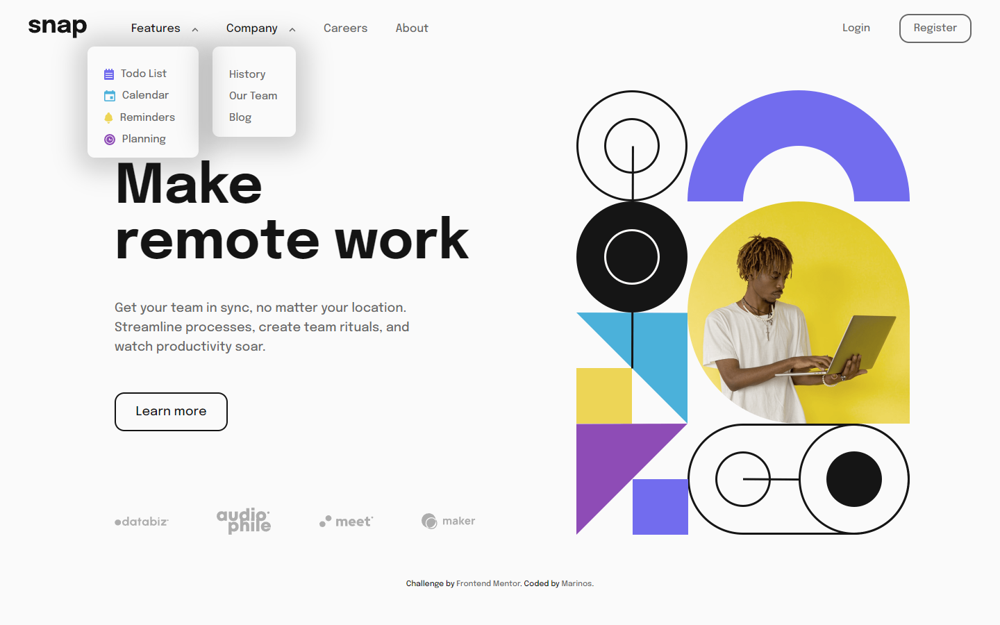
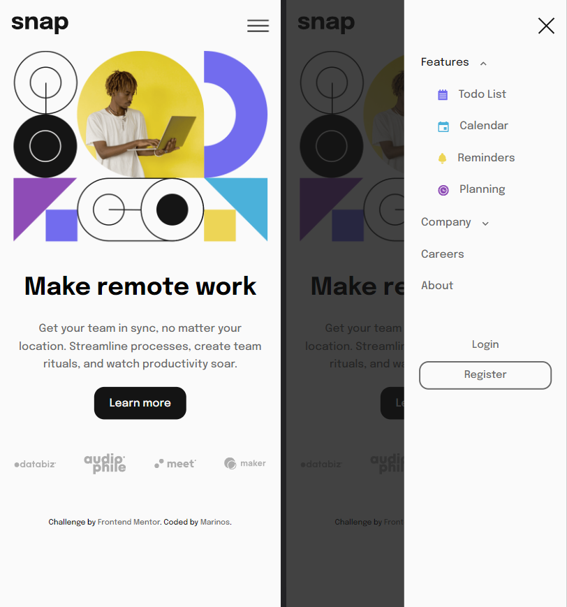

# Frontend Mentor - Intro section with dropdown navigation solution

This is a solution to the [Intro section with dropdown navigation challenge on Frontend Mentor](https://www.frontendmentor.io/challenges/intro-section-with-dropdown-navigation-ryaPetHE5). Frontend Mentor challenges help you improve your coding skills by building realistic projects. 

## Table of contents

- [Status](#website-status)
- [Overview](#overview)
  - [The challenge](#the-challenge)
  - [Screenshot](#screenshot-of-my-solution)
  - [Links](#links)
- [My process](#my-process)
  - [Built with](#built-with)
  - [Note](#note)
  - [Useful resources](#useful-resources)

## Website status

- In developpment...

## Overview

### The challenge

Users should be able to:

- View the relevant dropdown menus on desktop and mobile when interacting with the navigation links
- View the optimal layout for the content depending on their device's screen size
- See hover states for all interactive elements on the page

### Screenshot of my solution

### Links

- Live solution Demo: [Click here](https://marinvcq.github.io/intro-section-with-dropdown-navigation/)

## My process

### Built with

- Semantic HTML5 markup
- CSS custom properties
- Flexbox
- Mobile-first workflow
- SASS

### Note

- _style.sass is the main SASS file (only @import)
- _base.sass contain variable and general CSS
- _components.sass contain CSS style of Reusable components like button, nav-link, etc...
- Layout file contain all container and flexbox layout.

### Useful resources

- [Dropdown CSS](https://www.w3schools.com/css/css_dropdowns.asp) - Create a hoverable dropdown with CSS.
- [SASS structure](https://itnext.io/structuring-your-sass-projects-c8d41fa55ed4) - Structuring your SASS Project

## Front-end Style Guide

### Layout

The designs were created to the following widths:

- Mobile: 375px
- Desktop: 1440px

### Colors

#### Neutral

- Almost White: hsl(0, 0%, 98%)
- Medium Gray: hsl(0, 0%, 41%)
- Almost Black: hsl(0, 0%, 8%)

### Typography

#### Body Copy

- Font size (paragraph): 18px

#### Font

- Family: [Epilogue](https://fonts.google.com/specimen/Epilogue)
- Weights: 500, 700
